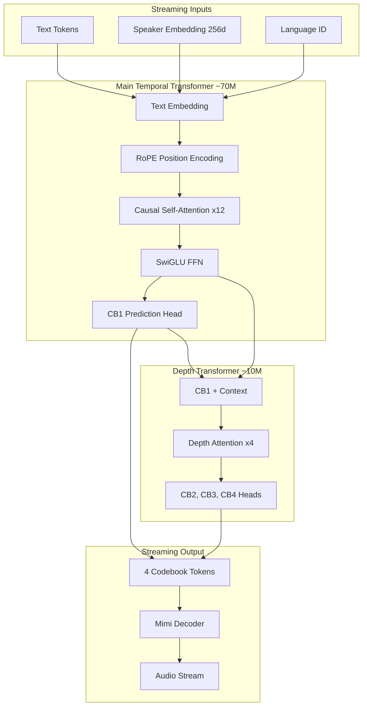
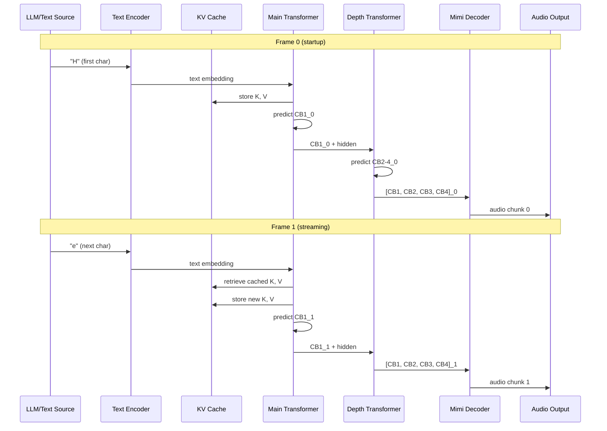

# Optimal Architecture for Small Streaming TTS Model

## Critical Design Decision: Autoregressive vs Non-Autoregressive

For **true bi-directional streaming** (text streaming in, audio streaming out), we must use an **autoregressive architecture**:| Approach | Input Streaming | Output Streaming | Quality | Latency ||----------|-----------------|------------------|---------|---------|| **Non-Autoregressive** (FastSpeech) | No - needs full text | Yes | Good | Very low || **Autoregressive** (GPT-style) | Yes | Yes | Excellent | Medium || **Hybrid** (Our choice) | Yes | Yes | Excellent | Low |**Conclusion**: We use autoregressive for semantic tokens + parallel depth for acoustic tokens.---

## Proposed Architecture: Streaming Codec LM



---

## Component Specifications

### 1. Main Temporal Transformer (~70M parameters)

**Purpose**: Autoregressive prediction of semantic codebook (CB1) from text| Component | Choice | Rationale ||-----------|--------|-----------|| **Layers** | 12 | Sweet spot for small models || **Hidden dim** | 768 | Standard, efficient || **Attention heads** | 12 | 64 dim per head || **KV heads (GQA)** | 4 | 3x memory reduction || **FFN dim** | 2048 | ~2.7x hidden (SwiGLU) || **Position encoding** | RoPE | Streaming-friendly, no length limit || **Normalization** | RMSNorm | Simpler, faster than LayerNorm || **Activation** | SwiGLU | Better quality per param || **Dropout** | 0.1 | Regularization |**Parameter count**:

- Embeddings: ~2M (text vocab ~4096 + audio vocab 2048)
- Attention per layer: 768 * 768 * 4 = 2.4M (with GQA savings)
- FFN per layer: 768 * 2048 * 3 = 4.7M (SwiGLU has 3 matrices)
- Total: ~70M

### 2. Depth Transformer (~10M parameters)

**Purpose**: Predict CB2-4 given CB1 and context (runs once per audio frame)| Component | Choice | Rationale ||-----------|--------|-----------|| **Layers** | 4 | Small but effective || **Hidden dim** | 512 | Smaller than main || **Attention heads** | 8 | 64 dim per head || **FFN dim** | 1024 | 2x hidden || **Input** | CB1 embedding + main transformer hidden state | Rich context || **Output** | 3 heads for CB2, CB3, CB4 | Parallel prediction |**Prediction strategy** (choose one):

- **Option A: Fully parallel** - Single forward pass, 3 output heads
- **Option B: Mini-AR** - 3 sequential steps within depth (CB1→CB2→CB3→CB4)

**Recommendation**: Option A (parallel) for simplicity and latency, unless quality suffers significantly.

### 3. Text-Audio Alignment (Critical for Streaming)

For streaming input, we cannot use explicit duration prediction. Instead:**Approach: Interleaved Text-Audio Tokens**

```javascript
Input sequence:  [TEXT] hello [AUDIO] <cb1_0> [TEXT] world [AUDIO] <cb1_1> <cb1_2> ...
```

The model learns implicitly when to emit audio tokens:

- Special `[AUDIO]` token signals transition to audio generation
- Model predicts how many audio frames per text segment
- Enables character-by-character text input

**Alternative: Fixed Delay Pattern**

```javascript
Text:   h  e  l  l  o  _  w  o  r  l  d
Audio:        |--|--|--|--|--|--|--|--|--|
             (audio lags text by N frames)
```

---

## Key Architectural Choices for Quality

### 1. Grouped Query Attention (GQA)

Reduces KV cache by 3x while maintaining quality:

```python
# Standard MHA: Q, K, V all have num_heads
# GQA: Q has num_heads, K/V have num_kv_heads (fewer)

num_heads = 12
num_kv_heads = 4  # Each KV head shared by 3 Q heads
```

**Benefits**:

- 3x smaller KV cache (critical for streaming)
- Faster inference
- Minimal quality loss

### 2. RoPE (Rotary Position Embeddings)

Essential for streaming - no fixed sequence length:

```python
# RoPE applies rotation based on position
# Works with any sequence length
# Supports KV cache efficiently
```

**Benefits**:

- No maximum sequence length
- Relative position awareness
- Efficient with caching

### 3. SwiGLU Activation

Better quality than ReLU/GELU for same parameter count:

```python
# SwiGLU: gate * swish(x)
def swiglu(x, W1, W2, W3):
    return (x @ W1) * F.silu(x @ W2) @ W3
```

**Benefits**:

- ~5-10% quality improvement over GELU
- Standard in modern LLMs (LLaMA, etc.)
- Easy to implement in C++

### 4. RMSNorm (Root Mean Square Normalization)

Simpler and faster than LayerNorm:

```python
def rmsnorm(x, weight, eps=1e-6):
    rms = torch.sqrt(torch.mean(x ** 2, dim=-1, keepdim=True) + eps)
    return x / rms * weight
```

**Benefits**:

- No mean computation (faster)
- Fewer parameters
- Easy C++ implementation

---

## Streaming Inference Pipeline



**Key streaming optimizations**:

1. **KV Cache**: Store key/value for all previous tokens
2. **Single token inference**: Process one new token at a time
3. **Incremental output**: Emit audio as soon as codebooks are predicted

---

## C++ Portability Considerations

### Dependencies to AVOID:

- PyTorch (use ONNX or custom inference)
- Complex Python libraries
- Dynamic computation graphs

### Dependencies that are OK:

- Kyutai Mimi (has C++ support via Rust bindings)
- ONNX Runtime (widely supported)
- Custom C++ transformer implementation

### Implementation Strategy:

```javascript
Option A: ONNX Export
- Train in PyTorch
- Export to ONNX
- Run with ONNX Runtime (C++ API)

Option B: Custom C++ (Recommended for minimal deps)
- Train in PyTorch
- Export weights to binary format
- Implement inference in pure C++ (~2000 lines)
- Link only Mimi for codec
```


### Portable Operations Only:

| Operation | C++ Implementation ||-----------|-------------------|| MatMul | BLAS or custom || RMSNorm | Simple loop || SwiGLU | Element-wise ops || RoPE | Sin/cos computation || Softmax | Standard formula || Embedding | Lookup table |---

## Training Strategy for Quality

### 1. Two-Stage Training

**Stage 1**: Train main transformer on CB1 prediction only

- Simpler task, faster convergence
- Use teacher forcing

**Stage 2**: Add depth transformer, train jointly

- Fine-tune main transformer
- Train depth from scratch

### 2. Knowledge Distillation (Optional but Recommended)

Train a larger teacher model first (~300M params), then distill:

- 2x faster inference
- 50%+ size reduction
- Maintains or improves quality

### 3. Data Augmentation

With 150h dataset:

- Speed perturbation (0.9x - 1.1x)
- Pitch shifting
- Noise injection
- Room simulation

---

## Final Architecture Summary